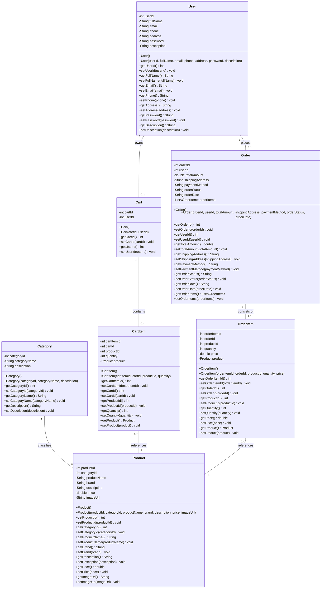

# System Architecture & Class Diagrams

This document describes the architectural layout, design patterns, component relationships, and complete class structures of the **FashionStore** application.

---

## 🏛️ High-Level MVC Design Pattern Architecture

FashionStore is architected using the standard **Model-View-Controller (MVC)** architectural pattern combined with the **Data Access Object (DAO)** pattern. This ensures clear separation of concerns, high maintainability, and loose coupling between presentation, application logic, and database persistence.

```mermaid
graph TD
    subgraph Client Layer
        Browser["🌐 User Web Browser"]
    end

    subgraph Controller Layer [Jakarta Servlets]
        AuthCtrl["LoginServlet / RegisterServlet / LogoutServlet"]
        CatalogCtrl["HomeServlet / ProductsServlet / ProductServlet / CategoryServlet / SearchServlet"]
        CartCtrl["CartServlet / RemoveCartItemServlet"]
        OrderCtrl["CheckoutServlet / OrderHistoryServlet"]
        StaticCtrl["AboutServlet / ContactServlet"]
    end

    subgraph View Layer [JSP Presentation Templates]
        JSPAuth["/views/auth/ (login.jsp, register.jsp)"]
        JSPHome["/views/home/ (home.jsp)"]
        JSPProd["/views/product/ (products.jsp, product.jsp)"]
        JSPCat["/views/category/ (category.jsp)"]
        JSPSearch["/views/search/ (search.jsp)"]
        JSPCart["/views/cart/ (cart.jsp)"]
        JSPOrder["/views/order/ (checkout.jsp, order-confirmation.jsp, orders.jsp)"]
    end

    subgraph DAO Layer [Data Access Objects]
        UDAO["UserDAO / UserDAOImpl"]
        PDAO["ProductDAO / ProductDAOImpl"]
        CDAO["CategoryDAO / CategoryDAOImpl"]
        CartDAO["CartDAO / CartDAOImpl"]
        ODAO["OrderDAO / OrderDAOImpl"]
    end

    subgraph Utility Layer
        DBC["DBConnection Manager"]
    end

    subgraph Database Layer [MySQL DB]
        MySQL[("🗄️ MySQL Database: fashion_store")]
    end

    subgraph Model Layer [Domain Objects / POJOs]
        Models["User | Product | Category | Cart | CartItem | Order | OrderItem"]
    end

    %% Flow interactions
    Browser -->|HTTP Request GET / POST| Controller Layer
    Controller Layer -->|Forward Data via Attributes| View Layer
    View Layer -->|Render HTML/CSS Response| Browser
    Controller Layer -->|Invoke Operations| DAO Layer
    DAO Layer -->|Request Connection| DBC
    DBC -->|JDBC DriverManager| MySQL
    DAO Layer <-->|Map ResultSets & Persist| Models
    Controller Layer <-->|Transfer Objects| Models
```

### Layered Responsibilities
1. **Model Layer (`com.fashionstore.model`)**: Pure Plain Old Java Objects (POJOs) representing domain entities with private encapsulation, constructors, getters, setters, and `toString()` methods.
2. **View Layer (`src/main/webapp/WEB-INF/views`)**: JSPs placed securely under `WEB-INF` to prevent direct public access. JSPs dynamically render HTML using JSTL and EL (Expression Language) attributes forwarded by Controllers.
3. **Controller Layer (`com.fashionstore.controller`)**: Servlets annotated with `@WebServlet` that intercept HTTP requests, validate parameters, manage HTTP session state, execute business operations via DAO interfaces, and forward/redirect execution.
4. **DAO Layer (`com.fashionstore.dao` & `com.fashionstore.dao.impl`)**: Interface-driven data access layer. DAO implementations execute parameterized SQL statements via `PreparedStatement` to prevent SQL Injection, and map `ResultSet` rows into Model instances.
5. **Utility Layer (`com.fashionstore.util`)**: Standardized JDBC connection factory (`DBConnection`) managing connection lifecycle and driver initialization (`com.mysql.cj.jdbc.Driver`).

---

## 📐 Class Diagrams

### 1. Model (Entity) Class Diagram

The model layer encapsulates the e-commerce domain data structures and object associations.



---

### 2. DAO Layer Class Diagram

The persistence abstraction layer isolates raw SQL queries and JDBC operations behind strict interfaces.

```mermaid
classDiagram
    class UserDAO {
        <<interface>>
        +registerUser(User user) boolean
        +loginUser(String email, String password) User
        +getUserById(int userId) User
        +updateUser(User user) boolean
    }

    class UserDAOImpl {
        -String INSERT_USER_SQL
        -String LOGIN_USER_SQL
        -String GET_USER_BY_ID_SQL
        -String UPDATE_USER_SQL
        +registerUser(User user) boolean
        +loginUser(String email, String password) User
        +getUserById(int userId) User
        +updateUser(User user) boolean
        -mapResultSetToUser(ResultSet rs) User
    }

    class ProductDAO {
        <<interface>>
        +getAllProducts() List~Product~
        +getProductById(int id) Product
        +getProductsByCategory(int categoryId) List~Product~
        +searchProducts(String keyword) List~Product~
    }

    class ProductDAOImpl {
        -String GET_ALL_PRODUCTS_SQL
        -String GET_PRODUCT_BY_ID_SQL
        -String GET_PRODUCTS_BY_CATEGORY_SQL
        -String SEARCH_PRODUCTS_SQL
        +getAllProducts() List~Product~
        +getProductById(int id) Product
        +getProductsByCategory(int categoryId) List~Product~
        +searchProducts(String keyword) List~Product~
        -mapProduct(ResultSet rs) Product
    }

    class CategoryDAO {
        <<interface>>
        +getAllCategories() List~Category~
        +getCategoryById(int categoryId) Category
    }

    class CategoryDAOImpl {
        -String GET_ALL_CATEGORIES_SQL
        -String GET_CATEGORY_BY_ID_SQL
        +getAllCategories() List~Category~
        +getCategoryById(int categoryId) Category
        -mapResultSetToCategory(ResultSet rs) Category
    }

    class CartDAO {
        <<interface>>
        +addToCart(CartItem cartItem) boolean
        +getCartItems(int cartId) List~CartItem~
        +updateCartItemQuantity(int cartItemId, int quantity) boolean
        +removeCartItem(int cartItemId) boolean
        +clearCart(int cartId) boolean
    }

    class CartDAOImpl {
        -String ADD_TO_CART_SQL
        -String GET_CART_ITEMS_SQL
        -String UPDATE_CART_ITEM_QUANTITY_SQL
        -String REMOVE_CART_ITEM_SQL
        -String CLEAR_CART_SQL
        +addToCart(CartItem cartItem) boolean
        +getCartItems(int cartId) List~CartItem~
        +updateCartItemQuantity(int cartItemId, int quantity) boolean
        +removeCartItem(int cartItemId) boolean
        +clearCart(int cartId) boolean
        -mapResultSetToCartItem(ResultSet rs) CartItem
    }

    class OrderDAO {
        <<interface>>
        +placeOrder(Order order) boolean
        +createOrder(Order order, List~OrderItem~ items) int
        +getOrdersByUser(int userId) List~Order~
        +getOrderById(int orderId) Order
        +getOrderItems(int orderId) List~OrderItem~
    }

    class OrderDAOImpl {
        -String PLACE_ORDER_SQL
        -String GET_ORDERS_BY_USER_SQL
        -String GET_ORDER_BY_ID_SQL
        -String GET_ORDER_ITEMS_SQL
        +placeOrder(Order order) boolean
        +createOrder(Order order, List~OrderItem~ items) int
        +getOrdersByUser(int userId) List~Order~
        +getOrderById(int orderId) Order
        +getOrderItems(int orderId) List~OrderItem~
        -mapResultSetToOrder(ResultSet rs) Order
        -mapResultSetToOrderItem(ResultSet rs) OrderItem
    }

    class DBConnection {
        -String URL = "jdbc:mysql://localhost:3306/fashion_store"
        -String USERNAME = "root"
        -String PASSWORD = "Prasad@18"
        -DBConnection()
        +getConnection() Connection$
    }

    UserDAO <|.. UserDAOImpl
    ProductDAO <|.. ProductDAOImpl
    CategoryDAO <|.. CategoryDAOImpl
    CartDAO <|.. CartDAOImpl
    OrderDAO <|.. OrderDAOImpl

    UserDAOImpl ..> DBConnection : retrieves Connection
    ProductDAOImpl ..> DBConnection : retrieves Connection
    CategoryDAOImpl ..> DBConnection : retrieves Connection
    CartDAOImpl ..> DBConnection : retrieves Connection
    OrderDAOImpl ..> DBConnection : retrieves Connection
```



---

### 3. Controller Layer Class Diagram

Servlets extend `HttpServlet` to process incoming user HTTP requests and manage UI navigation.

```mermaid
classDiagram
    class HttpServlet {
        <<abstract>>
        #doGet(HttpServletRequest req, HttpServletResponse resp)
        #doPost(HttpServletRequest req, HttpServletResponse resp)
    }

    class LoginServlet {
        -UserDAO userDAO
        #doGet(req, resp)
        #doPost(req, resp)
    }

    class RegisterServlet {
        -UserDAO userDAO
        #doGet(req, resp)
        #doPost(req, resp)
    }

    class LogoutServlet {
        #doGet(req, resp)
    }

    class HomeServlet {
        -ProductDAO productDAO
        +init()
        #doGet(req, resp)
    }

    class ProductsServlet {
        -ProductDAO productDAO
        -CategoryDAO categoryDAO
        #doGet(req, resp)
    }

    class ProductServlet {
        -ProductDAO productDAO
        +init()
        #doGet(req, resp)
    }

    class CategoryServlet {
        -ProductDAO productDAO
        -CategoryDAO categoryDAO
        +init()
        #doGet(req, resp)
    }

    class SearchServlet {
        -ProductDAO productDAO
        +init()
        #doGet(req, resp)
    }

    class CartServlet {
        -CartDAO cartDAO
        -ProductDAO productDAO
        #doGet(req, resp)
        #doPost(req, resp)
    }

    class RemoveCartItemServlet {
        -CartDAO cartDAO
        #doGet(req, resp)
    }

    class CheckoutServlet {
        -CartDAO cartDAO
        -OrderDAO orderDAO
        -ProductDAO productDAO
        #doGet(req, resp)
        #doPost(req, resp)
    }

    class OrderHistoryServlet {
        -OrderDAO orderDAO
        -ProductDAO productDAO
        #doGet(req, resp)
    }

    HttpServlet <|-- LoginServlet
    HttpServlet <|-- RegisterServlet
    HttpServlet <|-- LogoutServlet
    HttpServlet <|-- HomeServlet
    HttpServlet <|-- ProductsServlet
    HttpServlet <|-- ProductServlet
    HttpServlet <|-- CategoryServlet
    HttpServlet <|-- SearchServlet
    HttpServlet <|-- CartServlet
    HttpServlet <|-- RemoveCartItemServlet
    HttpServlet <|-- CheckoutServlet
    HttpServlet <|-- OrderHistoryServlet

    LoginServlet --> UserDAO
    RegisterServlet --> UserDAO
    HomeServlet --> ProductDAO
    ProductsServlet --> ProductDAO
    ProductsServlet --> CategoryDAO
    ProductServlet --> ProductDAO
    CategoryServlet --> ProductDAO
    CategoryServlet --> CategoryDAO
    SearchServlet --> ProductDAO
    CartServlet --> CartDAO
    CartServlet --> ProductDAO
    RemoveCartItemServlet --> CartDAO
    CheckoutServlet --> CartDAO
    CheckoutServlet --> OrderDAO
    CheckoutServlet --> ProductDAO
    OrderHistoryServlet --> OrderDAO
    OrderHistoryServlet --> ProductDAO
```


