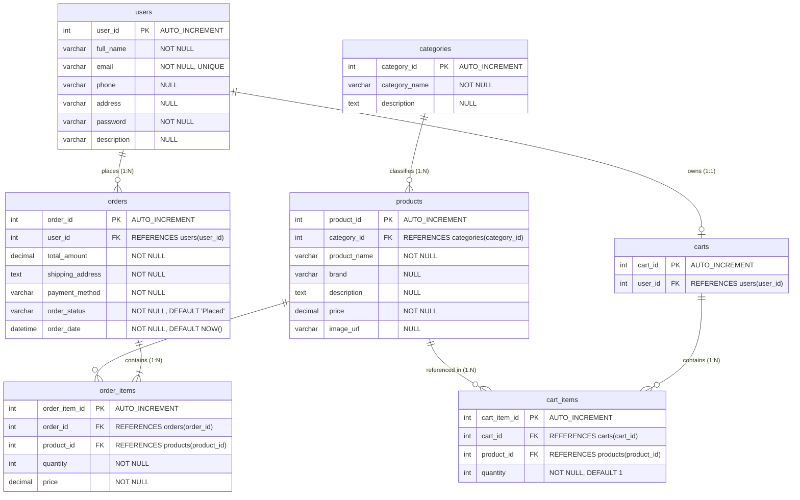

# Database Documentation & Object-Relational Mappings

This document details the relational database design for the **FashionStore** system hosted on MySQL (`fashion_store`), including table schemas, foreign key relationships, constraints, and entity-to-table mappings.

---

## 🗄️ Entity-Relationship Diagram (ERD)



---

## 📑 Database Table Schemas (DDL Specifications)

### 1. `users` Table
Stores user account profiles, authentication credentials, contact numbers, and delivery addresses.

```sql
CREATE TABLE users (
    user_id INT AUTO_INCREMENT PRIMARY KEY,
    full_name VARCHAR(100) NOT NULL,
    email VARCHAR(100) NOT NULL UNIQUE,
    phone VARCHAR(20),
    address TEXT,
    password VARCHAR(255) NOT NULL,
    description TEXT
);
```

| Column Name | Data Type | Nullable | Key / Constraint | Description |
|---|---|---|---|---|
| `user_id` | `INT` | NO | Primary Key (Auto-Increment) | Unique user identification key |
| `full_name` | `VARCHAR(100)` | NO | None | User's full name |
| `email` | `VARCHAR(100)` | NO | Unique Key | Authentication email address |
| `phone` | `VARCHAR(20)` | YES | None | User contact number |
| `address` | `TEXT` | YES | None | Primary shipping address |
| `password` | `VARCHAR(255)` | NO | None | Account login password |
| `description` | `TEXT` | YES | None | Optional bio or user notes |

---

### 2. `categories` Table
Categorizes fashion items into distinct departments (e.g., Men, Women, Accessories, Footwear).

```sql
CREATE TABLE categories (
    category_id INT AUTO_INCREMENT PRIMARY KEY,
    category_name VARCHAR(100) NOT NULL,
    description TEXT
);
```

| Column Name | Data Type | Nullable | Key / Constraint | Description |
|---|---|---|---|---|
| `category_id` | `INT` | NO | Primary Key (Auto-Increment) | Category unique identifier |
| `category_name` | `VARCHAR(100)` | NO | None | Display name of the category |
| `description` | `TEXT` | YES | None | Detailed category overview |

---

### 3. `products` Table
Holds individual product listings with prices, descriptions, category links, and image paths.

```sql
CREATE TABLE products (
    product_id INT AUTO_INCREMENT PRIMARY KEY,
    category_id INT NOT NULL,
    product_name VARCHAR(255) NOT NULL,
    brand VARCHAR(100),
    description TEXT,
    DECIMAL(10,2) NOT NULL,
    image_url VARCHAR(255),
    FOREIGN KEY (category_id) REFERENCES categories(category_id) ON DELETE CASCADE
);
```

| Column Name | Data Type | Nullable | Key / Constraint | Description |
|---|---|---|---|---|
| `product_id` | `INT` | NO | Primary Key (Auto-Increment) | Product unique identifier |
| `category_id` | `INT` | NO | Foreign Key -> `categories.category_id` | Associated category key |
| `product_name` | `VARCHAR(255)` | NO | None | Product title |
| `brand` | `VARCHAR(100)` | YES | None | Brand/manufacturer name |
| `description` | `TEXT` | YES | None | Detailed product specification |
| `price` | `DECIMAL(10,2)` | NO | None | Unit price of the item |
| `image_url` | `VARCHAR(255)` | YES | None | Path to product image asset |

---

### 4. `cart_items` Table
Stores line items currently held in user shopping carts.

```sql
CREATE TABLE cart_items (
    cart_item_id INT AUTO_INCREMENT PRIMARY KEY,
    cart_id INT NOT NULL,
    product_id INT NOT NULL,
    quantity INT NOT NULL DEFAULT 1,
    FOREIGN KEY (product_id) REFERENCES products(product_id) ON DELETE CASCADE
);
```

| Column Name | Data Type | Nullable | Key / Constraint | Description |
|---|---|---|---|---|
| `cart_item_id` | `INT` | NO | Primary Key (Auto-Increment) | Cart item entry identifier |
| `cart_id` | `INT` | NO | None (Logical FK -> `carts.cart_id`) | Session cart container key |
| `product_id` | `INT` | NO | Foreign Key -> `products.product_id` | Reference to selected product |
| `quantity` | `INT` | NO | Default: `1` | Purchased item count |

---

### 5. `orders` Table
Stores order headers containing order status, total price, payment method, shipping details, and timestamp.

```sql
CREATE TABLE orders (
    order_id INT AUTO_INCREMENT PRIMARY KEY,
    user_id INT NOT NULL,
    total_amount DECIMAL(10,2) NOT NULL,
    shipping_address TEXT NOT NULL,
    payment_method VARCHAR(50) NOT NULL,
    order_status VARCHAR(50) NOT NULL DEFAULT 'Placed',
    order_date DATETIME NOT NULL DEFAULT CURRENT_TIMESTAMP,
    FOREIGN KEY (user_id) REFERENCES users(user_id) ON DELETE CASCADE
);
```

| Column Name | Data Type | Nullable | Key / Constraint | Description |
|---|---|---|---|---|
| `order_id` | `INT` | NO | Primary Key (Auto-Increment) | Generated order tracking ID |
| `user_id` | `INT` | NO | Foreign Key -> `users.user_id` | Purchasing user ID |
| `total_amount` | `DECIMAL(10,2)` | NO | None | Order total monetary value |
| `shipping_address` | `TEXT` | NO | None | Full delivery address & contact |
| `payment_method` | `VARCHAR(50)` | NO | None | e.g., 'Cash on Delivery', 'Card' |
| `order_status` | `VARCHAR(50)` | NO | Default: `'Placed'` | Current status ('Placed', 'Shipped') |
| `order_date` | `DATETIME` | NO | Default: `NOW()` | Timestamp order was created |

---

### 6. `order_items` Table
Line-item snapshot of products purchased within a specific order.

```sql
CREATE TABLE order_items (
    order_item_id INT AUTO_INCREMENT PRIMARY KEY,
    order_id INT NOT NULL,
    product_id INT NOT NULL,
    quantity INT NOT NULL,
    price DECIMAL(10,2) NOT NULL,
    FOREIGN KEY (order_id) REFERENCES orders(order_id) ON DELETE CASCADE,
    FOREIGN KEY (product_id) REFERENCES products(product_id) ON DELETE RESTRICT
);
```

| Column Name | Data Type | Nullable | Key / Constraint | Description |
|---|---|---|---|---|
| `order_item_id` | `INT` | NO | Primary Key (Auto-Increment) | Order line item entry ID |
| `order_id` | `INT` | NO | Foreign Key -> `orders.order_id` | Parent order reference |
| `product_id` | `INT` | NO | Foreign Key -> `products.product_id` | Product purchased |
| `quantity` | `INT` | NO | None | Quantity purchased |
| `price` | `DECIMAL(10,2)` | NO | None | Locked unit price at checkout time |

---

## 🔗 Java POJO Model to Database Table Mapping Matrix

| Model Class (`com.fashionstore.model`) | Java Field | Database Table | Database Column | SQL Type | Key / Association Role |
|---|---|---|---|---|---|
| **`User`** | `userId` | `users` | `user_id` | `INT` | Primary Key |
| | `fullName` | `users` | `full_name` | `VARCHAR(100)` | Attribute |
| | `email` | `users` | `email` | `VARCHAR(100)` | Unique Attribute |
| | `phone` | `users` | `phone` | `VARCHAR(20)` | Attribute |
| | `address` | `users` | `address` | `TEXT` | Attribute |
| | `password` | `users` | `password` | `VARCHAR(255)` | Attribute |
| | `description` | `users` | `description` | `TEXT` | Attribute |
| **`Category`** | `categoryId` | `categories` | `category_id` | `INT` | Primary Key |
| | `categoryName` | `categories` | `category_name` | `VARCHAR(100)` | Attribute |
| | `description` | `categories` | `description` | `TEXT` | Attribute |
| **`Product`** | `productId` | `products` | `product_id` | `INT` | Primary Key |
| | `categoryId` | `products` | `category_id` | `INT` | Foreign Key -> `categories(category_id)` |
| | `productName` | `products` | `product_name` | `VARCHAR(255)` | Attribute |
| | `brand` | `products` | `brand` | `VARCHAR(100)` | Attribute |
| | `description` | `products` | `description` | `TEXT` | Attribute |
| | `price` | `products` | `price` | `DECIMAL(10,2)` | Attribute |
| | `imageUrl` | `products` | `image_url` | `VARCHAR(255)` | Attribute |
| **`Cart`** | `cartId` | `carts` | `cart_id` | `INT` | Primary Key |
| | `userId` | `carts` | `user_id` | `INT` | Foreign Key -> `users(user_id)` |
| **`CartItem`** | `cartItemId` | `cart_items` | `cart_item_id` | `INT` | Primary Key |
| | `cartId` | `cart_items` | `cart_id` | `INT` | Foreign Key -> `carts(cart_id)` |
| | `productId` | `cart_items` | `product_id` | `INT` | Foreign Key -> `products(product_id)` |
| | `quantity` | `cart_items` | `quantity` | `INT` | Attribute |
| | `product` | *(In-Memory Object)* | N/A | N/A | Populated via `ProductDAO.getProductById()` |
| **`Order`** | `orderId` | `orders` | `order_id` | `INT` | Primary Key |
| | `userId` | `orders` | `user_id` | `INT` | Foreign Key -> `users(user_id)` |
| | `totalAmount` | `orders` | `total_amount` | `DECIMAL(10,2)` | Attribute |
| | `shippingAddress` | `orders` | `shipping_address` | `TEXT` | Attribute |
| | `paymentMethod` | `orders` | `payment_method` | `VARCHAR(50)` | Attribute |
| | `orderStatus` | `orders` | `order_status` | `VARCHAR(50)` | Attribute |
| | `orderDate` | `orders` | `order_date` | `DATETIME` | Attribute |
| | `orderItems` | *(In-Memory List)* | N/A | N/A | Populated via `OrderDAO.getOrderItems()` |
| **`OrderItem`** | `orderItemId` | `order_items` | `order_item_id` | `INT` | Primary Key |
| | `orderId` | `order_items` | `order_id` | `INT` | Foreign Key -> `orders(order_id)` |
| | `productId` | `order_items` | `product_id` | `INT` | Foreign Key -> `products(product_id)` |
| | `quantity` | `order_items` | `quantity` | `INT` | Attribute |
| | `price` | `order_items` | `price` | `DECIMAL(10,2)` | Attribute |
| | `product` | *(In-Memory Object)* | N/A | N/A | Populated via `ProductDAO.getProductById()` |
