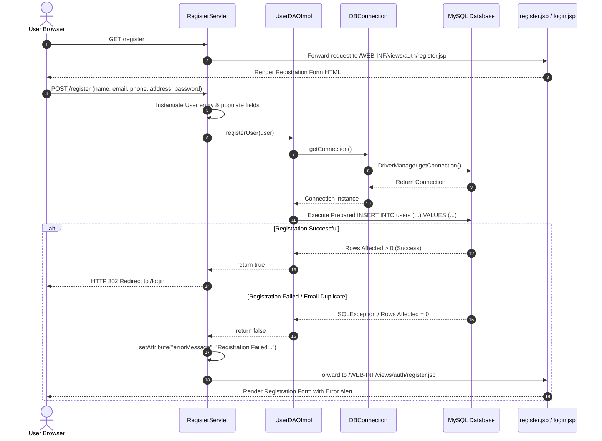
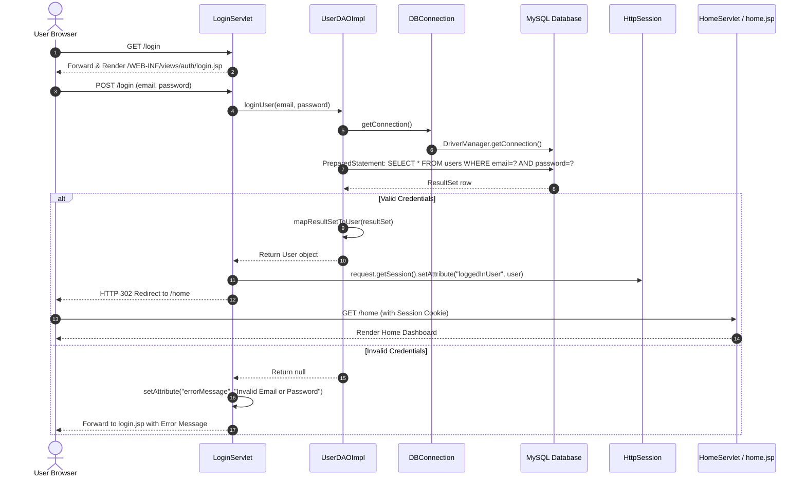
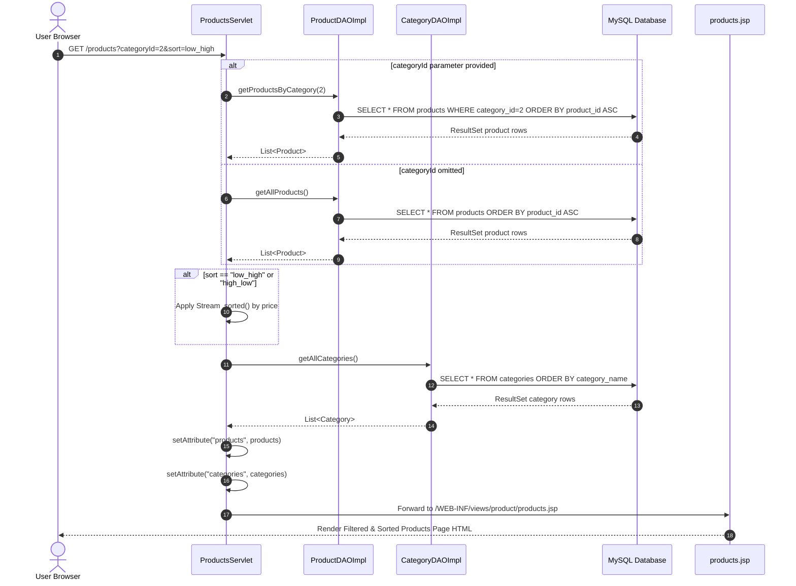
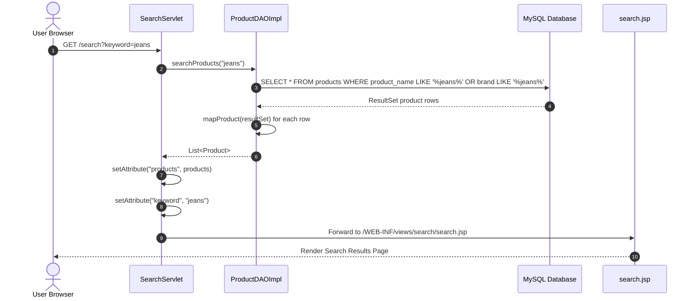
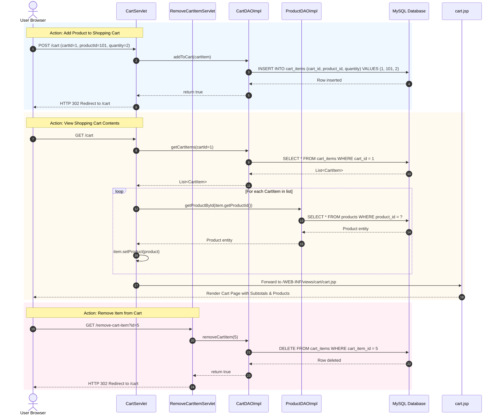
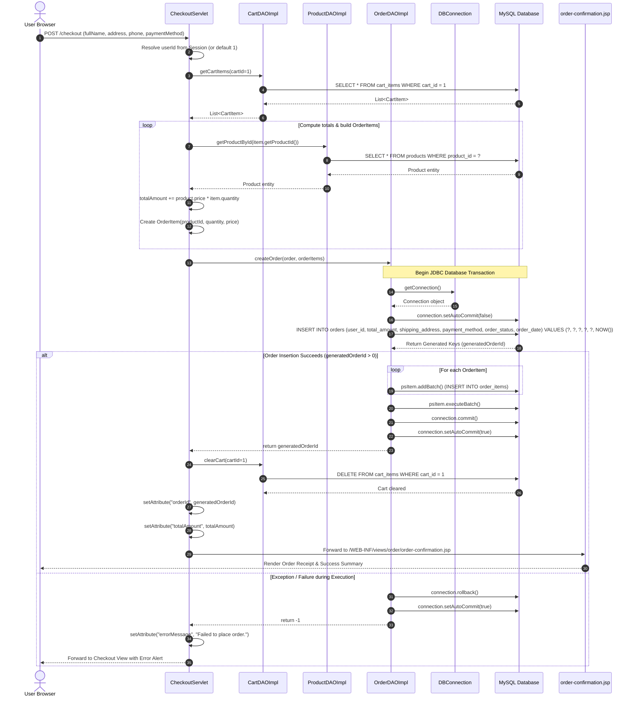
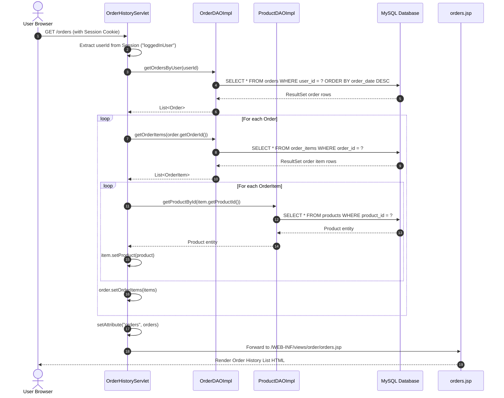
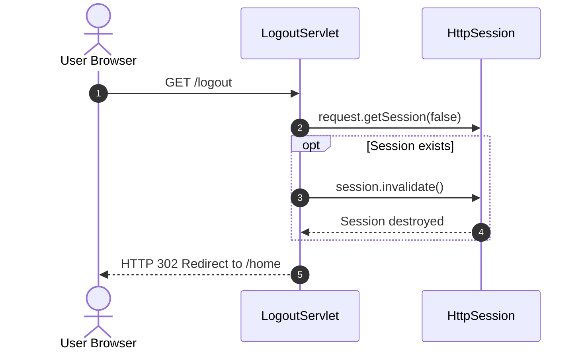

# System Sequence Diagrams

This document contains end-to-end **Mermaid Sequence Diagrams** illustrating the message passings, request-response execution flows, database calls, session bindings, and view forwards for every operational feature in **FashionStore**.

---

## 1. User Registration Flow

Illustrates a new user registering an account via `RegisterServlet`.

---

## 2. User Login & Authentication Flow

Illustrates user credential authentication, HTTP session creation, and state persistence.

---

## 3. Product Catalog Browsing & Category Filtering Flow

Illustrates fetching product catalogs, filtering by category, and dynamic in-memory price sorting.

---

## 4. Product Search Flow

Illustrates searching for products using partial matching across product title and brand.

---

## 5. Shopping Cart Management Flow

Illustrates adding items to cart, loading cart state with nested products, and deleting cart line items.

---

## 6. Transactional Order Checkout & Placement Flow

Illustrates transactional order creation, batch inserting line items, auto-commit management, rollback safety, and cart clearing.

---

## 7. Order History Retrieval Flow

Illustrates retrieving past orders placed by the user alongside detailed line item breakdown.

---

## 8. User Session Logout Flow

Illustrates invalidating user session state and terminating authentication.

